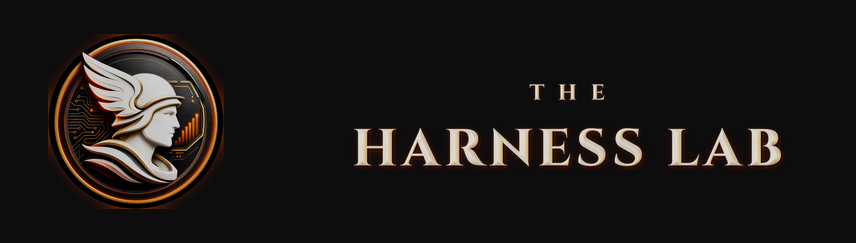

<p align="center">
  
</p>

<p align="center">
  <strong>The title workstation for petroleum landmen.</strong><br>
  Reads the records, builds the chain, computes ownership exactly, and produces the
  deliverable — on your own computer, with every number traceable to its source page.
</p>

<p align="center">
  <a href="../../releases/latest"><strong>⬇︎ Download for Windows, macOS or Linux</strong></a><br>
  <sub>
    <a href="https://title-desk.com/">Product site</a> ·
    <a href="https://title-desk.com/#buy">Pricing</a> ·
    <a href="docs/trials.md">Request an evaluation licence</a> ·
    <a href="docs/security-and-privacy.md">Security</a>
  </sub>
</p>

---

## The problem it solves

Much of a title project is repeatable: reading and indexing records,
cross-referencing instruments, transcribing parties and dates, recomputing
fractions, and retyping all of it into somebody's workbook. Those steps consume
the hours of the person whose judgment is actually needed.

TitleDesk absorbs that portion and hands back the part that matters — construing an
ambiguous conveyance, deciding a curative path, forming the opinion.

There is no universal time-savings number. County, document quality, assignment
scope, and the condition of the chain all matter. The honest way to qualify it is
to run a representative held-out assignment and compare elapsed time, accepted
rows, unsupported findings, and deliverable corrections against your existing process.

---

## Download

| Your computer | File | Notes |
|---|---|---|
| **Windows 10 / 11** (64-bit) | `TitleDesk-Agent-0.1.2-win-x64-Setup.exe` | Unsigned NSIS installer; verify the checksum |
| **macOS 12+** (Apple Silicon) | `TitleDesk-Agent-0.1.2-mac-arm64-UNSIGNED-EVALUATION.dmg` | Separate Intel (`x64`) DMG is also published |
| **Linux** (64-bit x86) | `TitleDesk-Agent-0.1.2-linux-x86_64.AppImage` | Single file, no installation |

**[→ Go to the latest release](../../releases/latest)**

Every release publishes a `SHA256SUMS` manifest listing the fingerprint of each file, so
you can confirm what you downloaded is exactly what was published. Windows and macOS
code signing is in progress; until it completes, verifying that checksum is what
establishes the file is genuine.

**Install guides:** [Windows](docs/install-windows.md) ·
[macOS](docs/install-macos.md) · [Linux](docs/install-linux.md) ·
**[First-run walkthrough](docs/first-run.md)**

---

## What it does

### Reading the records

- **On-device OCR.** Scanned county records are rasterised and read on your machine. No
  upload, no cloud queue, no per-page cost, and no account required to read a document.
- **Text-layer PDFs are read directly**, without needless OCR.
- **Built for real county packages.** A pool of OCR workers runs alongside several
  documents in flight, because most county records are one to three pages and would
  otherwise leave the pool idle. Hundreds of pages import without appearing to hang.
- **Duplicate-safe.** Concurrent reads of the same scan coalesce on content hash, so a
  document that arrives twice is extracted once and flagged as a copy of the original.
- **Progress only moves forwards**, even though documents finish out of order.

### Understanding them

- **Deterministic classification.** Document type, recording details and parties are
  extracted by code, not by a model.
- **Conservative by design.** The classifier reports *nothing* rather than guessing.
- **It knows a ratification from what it ratifies.** A ratification opens by reciting
  another instrument; reading book and page from the body would file it as the wrong
  document. The filename is treated as the stronger evidence of a document's own
  recording, and the body value is retained separately as a referenced recording.
- **Nothing is accepted silently.** Every extracted date, party and fraction stays
  *proposed* until you accept it, and each carries a link back to the page image it came
  from.

### Doing the title work

| Area | What it covers |
|---|---|
| **Paste Assignment** | Paste the assignment letter exactly as your company sent it. TitleDesk reads out the tracts, parties, deadlines and what is actually being asked for, then builds the project from it |
| **Projects** | Multiple jobs, each with its own records, chain, deadlines and deliverable |
| **Documents** | Every instrument, its extraction, its source page, and its status |
| **Runsheet** | The chain as it stands, assembled from accepted instruments |
| **Ownership** | Mineral and leasehold interests computed with exact fractions |
| **Wells & Leases** | Well and lease records tied to the tracts they burden |
| **Map** | Plat and tract visualisation, including shapefile import |
| **Issues & Curative** | Defects with their provenance and status, so nothing is resolved twice or silently |
| **Heirship Tree** | Succession worked as a graph — heirs, affidavits, probate, per-stirpes and per-capita distribution |
| **Deadlines** | What is due, and when |
| **Owners & Offers** | Owner contact and offer tracking |
| **Time & Billing** | Hours and billing against the project |
| **Research** | Approved outside sources, searched from inside the workflow |

### Producing the deliverable

- **Reports fill your own workbook.** Not a generic export — TitleDesk writes into the
  spreadsheet your client already expects.
- **A row is never overwritten.** Keys of rows already written are tracked, so re-running
  a report adds rather than clobbers.
- **A column it did not match is never touched.** Your working columns stay yours.
- **Excel Template Mapper** teaches TitleDesk a new client workbook by mapping its
  columns once.
- **Submit Package** assembles the deliverable set for turn-in.

### Working in rounds

A title assignment is rarely finished in one pass, and TitleDesk does not pretend
otherwise. Work is split into what the software does and what the landman does; both run
at once, and when both halves are done they are assembled.

```
draft ──approve──> running ──app column done──> awaiting_landman
                                                      │ landman completes her column
                                                      ▼
                                                 assembling
                                       ┌──────────────┴──────────────┐
                              work outstanding                 nothing open
                                       ▼                              ▼
                            draft (round N+1)                      review
                                                                      │ landman accepts
                                                                      ▼
                                                                  complete
```

**What is still outstanding is computed from the project's own records** — documents
read, instruments accepted, fractions that balance, defects still open — never by asking
a model whether the work is done. Only the landman completes an assignment, and she may
complete one with items still open; what was outstanding at that moment is recorded
rather than discarded.

---

## Why the arithmetic matters

Ownership is computed with **exact integer fractions**, never decimals.

This is not a detail. As a decimal, one third is `0.333…`, and three of them do not sum
to one. Carried through a chain of title, that error compounds — and it compounds into
real money on a real mineral interest.

TitleDesk reports a tract as over-conveyed by exactly **`1/4`**. Never by
`0.24999999999999997`.

`1/3 + 1/3 + 1/3` balances to exactly `1`, and there is an automated test that says so.

---

## Your data stays yours

The full detail is in **[Security and privacy](docs/security-and-privacy.md)**. The short
version:

| | Leaves your computer? |
|---|---|
| Title documents, scans, county records | **No** |
| OCR text and extractions | **No** |
| Ownership calculations, runsheets, reports | **No** |
| Project files and folders | **No** |
| Licence activation (device fingerprint, licence status) | Yes — to the licence service only |
| Content you explicitly send to a connected AI | Yes — to the provider you chose |
| Files you sync to a Drive workspace you connected | Yes — to your own Google Drive |

- **Encrypted at rest** with AES-256-GCM, the key held in the operating system's own
  keychain — Keychain on macOS, DPAPI on Windows, libsecret on Linux. Copying the
  database off the machine yields nothing readable. TitleDesk **refuses to start** if the
  keychain is unavailable rather than quietly falling back to plaintext.
- **The activity log is append-only**, enforced by database triggers. The application
  itself cannot alter or delete an entry.
- **Company Google Drive is read-only at the token**, not by policy. The access token is
  minted with a read-only scope, so Google itself refuses a write. There is no sequence
  of clicks that turns it on.
- **Outbound destinations are allow-listed.** Until you name a host, TitleDesk refuses to
  send anywhere at all.

### Working with AI — or without it

TitleDesk is **fully functional with no AI connected**. Reading documents, the runsheet,
ownership, deadlines, billing and report generation are all local. Connecting a model
only adds drafting assistance.

When one *is* connected:

- It receives a **fixed, enumerated toolset** — no shell, no arbitrary file access, no
  arbitrary network. Anything not on that list is unreachable, however the model is
  prompted.
- **It proposes; a person disposes.** Nothing it suggests about your configuration takes
  effect until a human reads a plain-English description and approves it.
- Choose a **ChatGPT/Codex or Claude subscription**, **your own API key**, or a **local
  model via Ollama** if nothing may leave the machine at all.
  See [choosing an AI](docs/choosing-an-ai.md).

---

## Built to fit your company

Land departments do not run title the same way — the order of work, what gets approved
and by whom, what the deliverable must contain, which sources are authoritative.

- **Customization Lab** exists so a company can bend TitleDesk to how it actually works.
  State the difference in plain language — *"make me approve every instrument before it
  goes in the runsheet"* — and it adopts it. Every change is shown in plain English and
  takes effect only when someone approves it.
- **Special Requests** is available from every screen. Ask for something the application
  does not obviously let you do, in your own words. It returns a proposal you approve or
  decline; it never acts on its own.
- **Company and personal workspaces are isolated.** A company can configure TitleDesk
  once and distribute that configuration to its landmen. An independent contractor
  working for several operators can hold multiple company configurations side by side —
  one company's workspace cannot read another's, and a workspace can be removed from the
  machine entirely along with its data.
- **Guided onboarding.** *Getting started* is an agent, not a page of instructions: it
  tracks what you have and have not done, answers questions in your own words, and never
  leaves you at a dead end.

---

## Requirements

- **Windows** 10 or 11, 64-bit · **macOS** 12 (Monterey) or later · **Linux** 64-bit
- About 700 MB free
- **No internet required** for ordinary work. Activation needs a connection once, then
  TitleDesk keeps working offline for an extended period — a day in a courthouse
  basement with no signal will not lock you out.

---

## Try it

TitleDesk is commercial software; every copy activates against a licence.

- **Evaluating?** [Request an evaluation licence](docs/trials.md). It is the full
  application, not a reduced build, it is time-limited, and it expires on its own —
  nothing to cancel and no card required.
- **Buying?** Plans and checkout are on the
  [product site](https://title-desk.com/#buy).
- **Deploying across a land department?** Email
  [sales@theharnesslab.com](mailto:sales@theharnesslab.com) and we will set it up rather
  than issuing individual trials.

---

## Support

TitleDesk is built and supported by The Harness Lab.

**[sales@theharnesslab.com](mailto:sales@theharnesslab.com)**

[Privacy policy](https://title-desk.com/privacy/) ·
[Terms](https://title-desk.com/terms/) ·
[FAQ](docs/faq.md)

Please don't send title documents, credentials, activation codes or payment-card details
by email — a description and a screenshot is enough to work from.

---

<p align="center">
  <a href="https://github.com/THE-HARNESS-LAB">
    
  </a>
</p>

<p align="center">
<sub>TitleDesk Agent is a product of <a href="https://github.com/THE-HARNESS-LAB">The Harness Lab</a>.
This repository carries releases and documentation; the application source is not public.
Companies with procurement requirements around source escrow or security review should get in touch.</sub>
</p>
